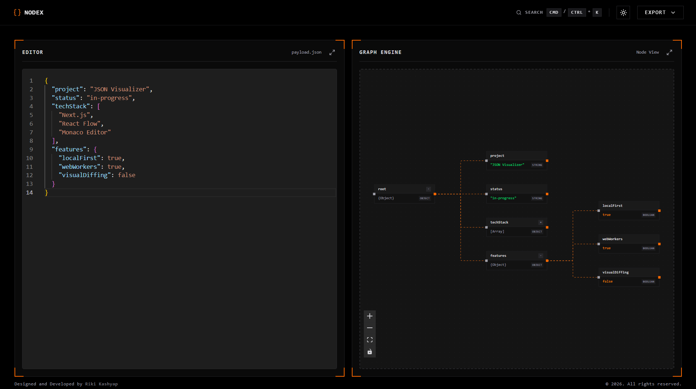
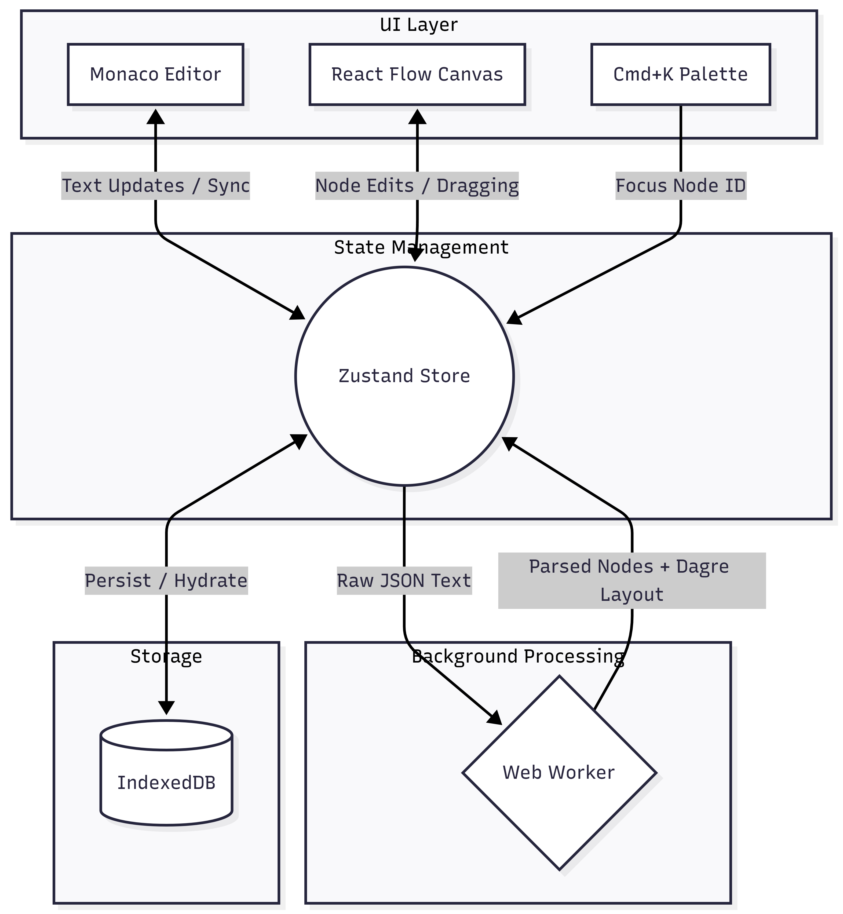

#  Nodex

> Stop scrolling through endless JSON strings. Visualize, edit, and share massive data structures instantly.

## What is Nodex

Nodex is a local-first, high-performance developer tool that transforms complex JSON payloads into beautiful, interactive, and editable graph diagrams. Built with a tech-minimalist aesthetic, Nodex processes massive JSON structures directly in your browser without ever sending your sensitive data to a server.

[](https://nodex-jv.vercel.app)

## Features

* **Local-First & Secure**: Zero server calls. All JSON parsing, layout calculations, and state persistence happen entirely within your browser using Web Workers and IndexedDB. Your proprietary data never leaves your machine.
* **Bidirectional Editing**: Edit values directly on the canvas nodes, or type in the Monaco Editor—changes sync bidirectionally in real-time.
* **Freeze-Proof UI**: Heavy JSON parsing and Dagre auto-layout calculations are offloaded to a background Web Worker, ensuring the UI remains buttery smooth at 60fps.
* **Smart Collapsible Nodes**: Effortlessly navigate massive nested objects by collapsing and expanding tree branches. The graph auto-recalculates its layout instantly.
* **Global Cmd+K Search**: Instantly find specific keys or values across thousands of nodes with a built-in, keyboard-first command palette that auto-focuses the target node.
* **Shareable Workspaces**: Generate instant, stateless shareable URLs encoding your entire JSON architecture via Base64, or export high-res transparent PNGs of your graph.

## Architecture & Workflow

Nodex utilizes a highly decoupled, reactive architecture to ensure maximum performance and seamless data synchronization.



### The Data Flow

1. **Input**: User pastes JSON into the Monaco Editor or loads a Base64 URL.
2. **Offloading**: Zustand state captures the text and immediately sends it to the Web Worker.
3. **Processing**: The Worker parses the JSON, calculates deep object paths for editing, applies the `Dagre` directed-graph layout, and returns spatial node coordinates.
4. **Rendering**: React Flow paints the nodes. Double-clicking a primitive value triggers an update via the object path, automatically stringifying back to the Monaco Editor.
5. **Persistence**: `idb-keyval` silently commits the graph state to IndexedDB in the background for instant reload recovery.

## Tech Stack

| Category | Technologies |
| --- | --- |
| **Framework** | Next.js 16 (App Router), React 19 |
| **Graph Engine** | React Flow (`@xyflow/react`), Dagre (Auto-layout) |
| **State & Data** | Zustand, IndexedDB (`idb-keyval`), Web Workers |
| **Editor & UI** | Monaco Editor, Tailwind CSS v4, Framer Motion, Lucide Icons |
| **Tooling** | TypeScript, ESLint, PNPM, `html-to-image`, `cmdk` |

## Project Structure

```text
nodex/
├── app/                  # Next.js App Router (layout, globals, page)
├── components/           
│   ├── editor/           # Monaco JSON Editor integration
│   ├── graph/            # React Flow canvas, custom JsonNode components
│   ├── ui/               # Reusable UI (Command Palette, Export Menu, Theme Toggle)
│   └── workspace/        # Main Layout composing Editor and Graph
├── lib/                  
│   ├── json-parser.ts    # JSON to Node/Edge transformer & path tracker
│   ├── layout-engine.ts  # Dagre directional layout logic
│   └── graph.worker.ts   # Background Web Worker entry point
├── store/                
│   └── graph-store.ts    # Zustand global state & IndexedDB persistence
└── public/               # Static assets, logos, and OG images

```

## Getting Started

Because Nodex is strictly local-first and client-side, setup takes seconds. There are no databases to provision or environment variables to configure.

### Prerequisites

* Node.js >= 22
* PNPM >= 9.x

### Local Development

```bash
# Install dependencies
pnpm install

# Start the development server with Fast Refresh
pnpm dev

```

Open [http://localhost:3000](http://localhost:3000) in your browser.

## Scripts

| Command | Description |
| --- | --- |
| `pnpm dev` | Starts the application in development mode |
| `pnpm build` | Compiles the optimized static application for production |
| `pnpm start` | Runs the compiled production application |
| `pnpm lint` | Runs ESLint checks across the codebase |

## Deployment

Nodex is entirely static and client-side, making it incredibly cheap and fast to host.

* **Recommended**: Deploy to **Vercel** with zero configuration. Simply import the repository, and Vercel will automatically detect Next.js and build the static assets.
* **Alternative**: Host on any static edge network (Cloudflare Pages, Netlify, GitHub Pages).

## License

This project is licensed under the MIT License. See the `LICENSE` file for details.