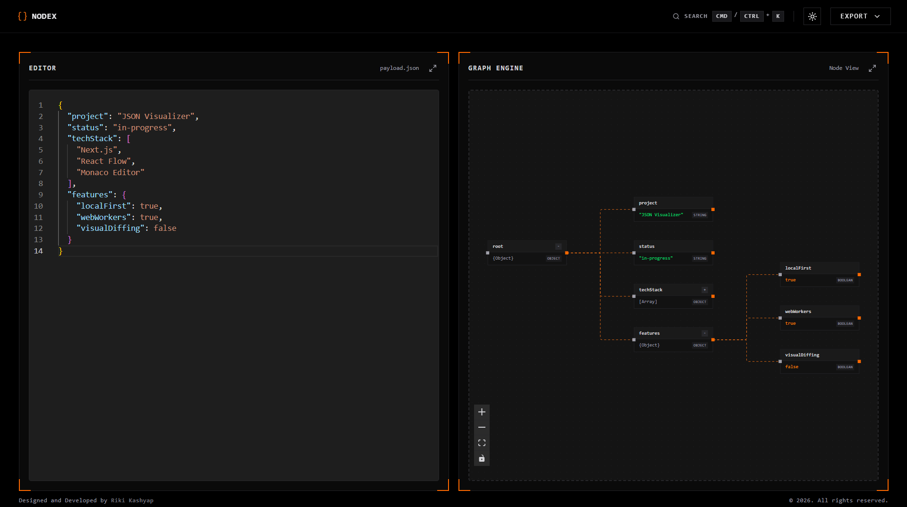
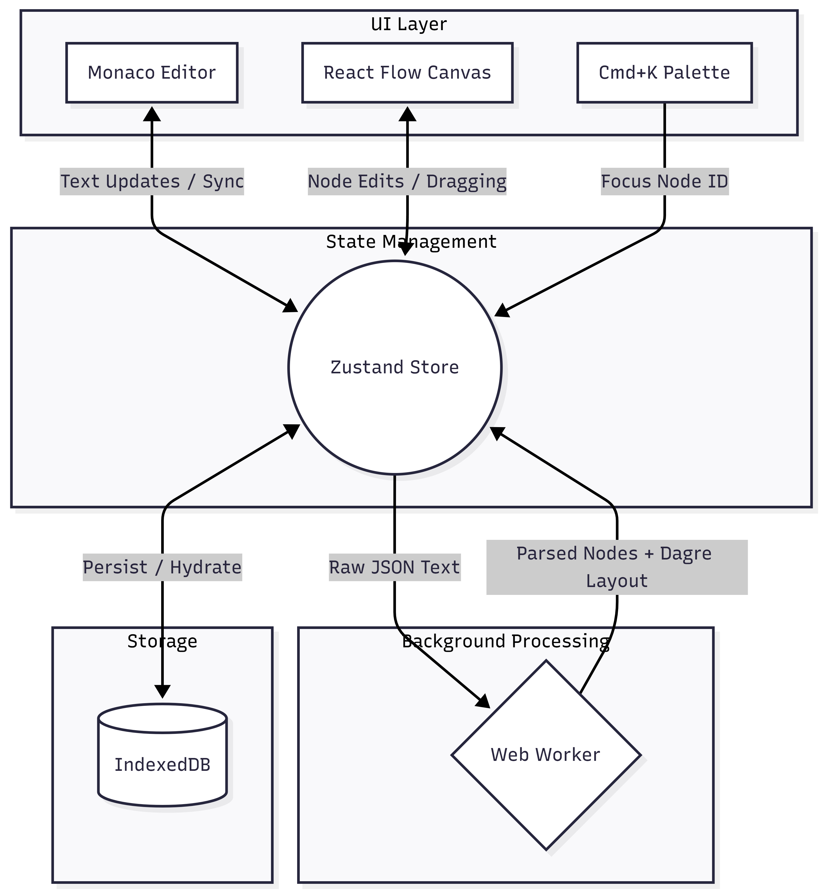

# Nodex

> Stop scrolling through endless JSON strings. Visualize, edit, and share massive data structures instantly.

## What is Nodex

Nodex is a local-first, high-performance developer tool that transforms complex JSON payloads into beautiful, interactive, and editable graph diagrams. Built with a tech-minimalist aesthetic, Nodex processes massive JSON structures directly in your browser without ever sending your sensitive data to a server.

[](https://nodex-jv.vercel.app)

## The Problem

When working with large API responses or deeply nested JSON, understanding the structure can become difficult.

A typical JSON payload requires you to:

- Scroll through large text files
- Search for deeply nested keys
- Mentally understand parent-child relationships
- Make small edits while keeping track of where values belong

For me, this became frustrating when working with complex JSON structures.

## The Solution

Nodex turns nested JSON into an interactive visual graph.

Instead of only reading JSON as a large text document, you can see its structure spatially:

- Objects and arrays become graph nodes
- Relationships between values are represented as edges
- Nested branches can be collapsed and expanded
- Primitive values can be edited directly on the graph
- Changes stay synchronized with the JSON editor

The application runs primarily in the browser and stores workspace state locally.

## Features

- **Local-First & Secure**: Zero server calls. All JSON parsing, layout calculations, and state persistence happen entirely within your browser using Web Workers and IndexedDB. Your proprietary data never leaves your machine.
- **Bidirectional Editing**: Edit values directly on the canvas nodes, or type in the Monaco Editor — changes sync bidirectionally in real-time.
- **Freeze-Proof UI**: Heavy JSON parsing and Dagre auto-layout calculations are offloaded to a background Web Worker, ensuring the UI remains responsive.
- **Smart Collapsible Nodes**: Effortlessly navigate massive nested objects by collapsing and expanding tree branches. The graph auto-recalculates its layout instantly.
- **Global Cmd+K Search**: Instantly find specific keys or values across thousands of nodes with a built-in, keyboard-first command palette that auto-focuses the target node.
- **Shareable Workspaces**: Generate instant, stateless shareable URLs encoding your entire JSON architecture via Base64, or export high-resolution transparent PNGs of your graph.

## Architecture & Workflow

Nodex utilizes a highly decoupled, reactive architecture to ensure maximum performance and seamless data synchronization.



### The Data Flow

1. **Input**: User pastes JSON into the Monaco Editor or loads a Base64 URL.
2. **Offloading**: Zustand state captures the text and immediately sends it to the Web Worker.
3. **Processing**: The Worker parses the JSON, calculates deep object paths for editing, applies the `Dagre` directed-graph layout, and returns spatial node coordinates.
4. **Rendering**: React Flow paints the nodes. Double-clicking a primitive value triggers an update via the object path, automatically stringifying back to the Monaco Editor.
5. **Persistence**: `idb-keyval` silently commits the graph state to IndexedDB in the background for instant reload recovery.

## Tech Stack

| Category | Technologies |
| --- | --- |
| Framework | Next.js 16, React 19 |
| Language | TypeScript |
| Editor | Monaco Editor |
| Graph | React Flow |
| Layout | Dagre |
| State Management | Zustand |
| Persistence | IndexedDB, idb-keyval |
| Background Processing | Web Workers |
| Styling | Tailwind CSS |
| Animation | Framer Motion |
| Icons | Lucide React |
| Export | html-to-image |
| Package Manager | PNPM |

## Project Structure

```text
nodex/
├── app/
│   ├── layout.tsx
│   ├── page.tsx
│   └── globals.css
│
├── components/
│   ├── editor/
│   │   └── JsonEditor.tsx
│   │
│   ├── graph/
│   │   ├── GraphCanvas.tsx
│   │   └── JsonNode.tsx
│   │
│   ├── ui/
│   │   ├── CommandPalette.tsx
│   │   ├── CornerBox.tsx
│   │   ├── ExportMenu.tsx
│   │   ├── ThemeProvider.tsx
│   │   └── ThemeToggle.tsx
│   │
│   └── workspace/
│       └── WorkspaceLayout.tsx
│
├── lib/
│   ├── graph.worker.ts
│   ├── json-parser.ts
│   └── layout-engine.ts
│
├── store/
│   └── graph-store.ts
│
└── public/
    └── ...
````

## Getting Started

Follow these steps to run Nodex locally.

### Prerequisites

Make sure the following are installed:

* Node.js 22 or newer
* PNPM 10 or newer
* Git

You can verify your installed versions with:

```bash
node --version
pnpm --version
git --version
```

### Installation

Clone the repository and install the dependencies:

```bash
git clone https://github.com/riki-k-dev/nodex.git
cd nodex
pnpm install
```

### Development

Start the local development server:

```bash
pnpm dev
```

Once the server starts, open:

```text
http://localhost:3000
```

The development server supports hot reload, so changes made to the source code will be reflected automatically.

### Production Build

Create an optimized production build:

```bash
pnpm build
```

Run the production build locally:

```bash
pnpm start
```

Then open:

```text
http://localhost:3000
```

### Lint

Run ESLint to check the project for linting issues:

```bash
pnpm lint
```

### Available Commands

| Command      | Purpose                          |
| ------------ | -------------------------------- |
| `pnpm dev`   | Start the development server     |
| `pnpm build` | Create a production build        |
| `pnpm start` | Run the production build locally |
| `pnpm lint`  | Run ESLint                       |

## Testing

The application was manually tested for:

* JSON persistence after refresh
* Editing graph values and syncing changes to the editor
* Persistence of graph edits
* Collapse and expand behavior
* Collapse state persistence
* Keyboard search with `Cmd/Ctrl + K`
* Search result graph focus
* Shareable JSON links
* Opening shared links in a new browser context
* PNG graph export
* Invalid share URLs
* Empty JSON input
* Invalid JSON input
* Recovery from invalid to valid JSON
* Objects and arrays
* Nested arrays and objects
* Strings with special characters
* Numbers
* Booleans
* `null` values
* Production lint and build

Production checks:

```text
pnpm lint  → passed
pnpm build → passed
```

## Deliberately Not Implemented

Nodex is intentionally scoped as a focused local JSON visualization tool.

The following are deliberately outside the current scope:

* User accounts and authentication
* Cloud-based workspace synchronization
* Server-side JSON storage
* Team collaboration
* Real-time multiplayer editing
* Database-backed projects
* Version history
* Git integration
* Advanced JSON schema validation
* Editing object keys directly from graph nodes
* Editing object and array structures directly from graph nodes
* Importing files from cloud storage
* Large-scale enterprise workspace management

These could be added in a larger product, but were intentionally excluded to keep this project focused and finishable.

## Scope Decisions

A few design decisions were made specifically to keep the project manageable:

### Local-first

JSON data is processed in the browser rather than building a backend service for storing user payloads.

This keeps the project focused on the visualization and editing experience.

### Primitive Value Editing

Graph editing is limited to primitive values such as:

* strings
* numbers
* booleans
* null

Objects and arrays are represented visually but are not directly structurally edited from graph nodes.

### URL Sharing

Share links encode the current JSON into the URL rather than introducing a backend sharing system.

This keeps sharing simple while avoiding authentication and database infrastructure.

## What I Learned

Building Nodex required working through several areas beyond basic UI implementation:

* Transforming recursive JSON structures into graph data
* Tracking object paths for bidirectional editing
* Working with React Flow nodes and edges
* Calculating graph layouts with Dagre
* Moving processing work into a Web Worker
* Persisting application state with IndexedDB
* Synchronizing editor and graph state
* Handling invalid and empty input states
* Designing recovery paths for failed input
* Building keyboard-driven search and graph navigation
* Exporting a rendered graph as an image

## Demo

Live application:

**[https://nodex-jv.vercel.app](https://nodex-jv.vercel.app)**

Try this workflow:

1. Enter a nested JSON payload.
2. Explore the generated graph.
3. Collapse and expand nested branches.
4. Press `Cmd/Ctrl + K` and search for a key or value.
5. Double-click a primitive value to edit it.
6. Refresh the page and verify the workspace persists.
7. Use **Export** to generate a shareable link or PNG.

## License

This project is licensed under the MIT License.
